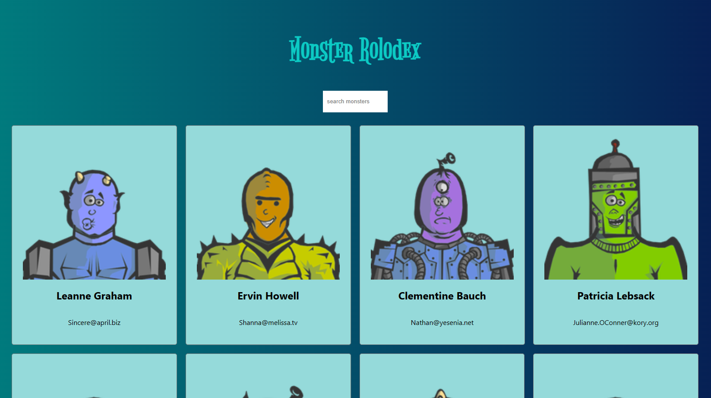

# React Basic

## React Key Concepts

1. Don't touch DOM, I'll do it.
   - Declarative - Just focus on how your APP will look like, react will handle DOM for you.
2. Build website like lego blocks.
   - Component - You can reuse it anywhere.
3. Unidirectional data flow.
   - Data can never move up.
4. UI, the rest is up to you.
   - Learn once, use it on any platform.

### How to be a great react developer

1. Decide on component
2. Decide the state and where it lives
3. What changes when state changes

## Monster rolodex - our first react project



### npx and create-react-app

We'll use `npx` and `create-react-app` to create out react project

```sh
# install npx
$ npm install -g npx
...

# then use npx to run create-react-app to create out `monster-rolodex` project
$ npx create-react-app monster-rolodex --template typescript # using typescript
...
```

### Play with our first state

Before we dive into detail of the project, let't take a look of 'state'. State is
a way how we can manage and store data that can change over time.

In the functional component, we can use the `useState` - a **Hooks** to manage state.

```ts
const App = () => {
  const [name, setName] = React.useState('Angus');

  const changeNameToBoB = () => {
    // use the setName function to change actually change the value of name
    setName('Bob');
  };

  return (
    <div className='App'>
      <header className='App-header'>
        
        <p>Hi {name}!</p>
        <button onClick={changeNameToBoB}>Change Name</button>
      </header>
    </div>
  );
};
```

### Using array to build the rolodex

In the rolodex, we'll gonna have a lot of monsters, and let's see how we can
handle that using array.

```ts
const App = () => {
  // store the monsters in a array
  const monsters = [
    {
      id: '1',
      name: 'Linda',
    },
    {
      id: '2',
      name: 'Frank',
    },
    {
      id: '3',
      name: 'Jacky',
    },
  ];

  return (
    <div className='App'>
      // map will return a new array which in this case will be
      // an array of <div> and <h1> tag element
      {monsters.map((monster) => {
        return (
         // do make sure set the unique key for each element
         // to differentiating each element for react to optimize
         // the code
         <div key={monster.id}>
           <h1>{monster.name}</h1>
         </div>
        );
      })}
    </div>
  );
};
```

### Fetch monsters by calling API

In the real world, data will not be hard coded most of time, so we need to
fetch the data by calling APIs, and here's how we can do it.

```ts
type Monster = {
  id: string;
  name: string;
  email: string;
};

const App = () => {
  // create a state to store and manage monsters
  const [monsters, setMonsters] = React.useState<Monster[]>([]);

  // use useEffect hook to make sure this action is under react lifecycle
  React.useEffect(() => {
    // fetch users data from API
    fetch('https://jsonplaceholder.typicode.com/users')
      // convert it to json
      .then((response) => response.json())
      // using setMonsters to actually update monsters array
      .then((users: Monster[]) => setMonsters(users));
  }, []);

  return (
    <div className='App'>
      {monsters.map((monster) => {
        return (
          <div key={monster.id}>
            <h1>{monster.name}</h1>
          </div>
        );
      })}
    </div>
  );
};
```

### Searching in rolodex

Now that we have a list of monsters, let's implement the search functionality.

```ts
const App = () => {
  // create a state to store and manage value of searchField
  const [searchField, setSearchField] = React.useState('');
  const [monsters, setMonsters] = React.useState<Monster[]>([]);
  // create a state to store and manage the value of filtered monsters
  const [filteredMonsters, setFilteredMonsters] = React.useState<Monster[]>([]);

  React.useEffect(() => {
    fetch('https://jsonplaceholder.typicode.com/users')
      .then((response) => response.json())
      .then((users: Monster[]) => setMonsters(users));
  }, []);

  // useEffect hook to handle filtering of monsters based on searchField
  React.useEffect(() => {
    // filter monsters whose name includes the `searchField` text (case-insensitive)
    const filteredMonsters = monsters.filter((monster) =>
      monster.name.toLowerCase().includes(searchField)
    );
    // update the state with the filtered monsters
    setFilteredMonsters(filteredMonsters);
  }, [monsters, searchField]);

  // event handler to update the searchField state when the input changes
  const handleSearchFieldChange = (
    event: React.ChangeEvent<HTMLInputElement>
  ) => {
    const value = event.target.value.toLocaleLowerCase();
    setSearchField(value);
  };

  return (
    <div className='App'>
      {/* Input field for searching monsters */}
      <input
        className='search-box'
        type='search'
        placeholder='Search monsters'
        onChange={handleSearchFieldChange}
      />
      {filteredMonsters.map((monster) => {
        return (
          <div key={monster.id}>
            <h1>{monster.name}</h1>
          </div>
        );
      })}
    </div>
  );
};
```

#### Using React Query

In the example above, we use `useEffect` hook to trigger `fetch` when component mounted,
but there is a better way to do it, which is **React Query** (`uesQuery`).

```ts
const fetchMonsters = async () => {
  const response = await axios.get(
    'https://jsonplaceholder.typicode.com/users'
  );

  return response.data;
};

const App = () => {
  const [searchField, setSearchField] = useState('');
  const [filteredMonsters, setFilteredMonsters] = useState<Monster[]>([]);

  const { data: monsters } = useQuery<Monster[]>(['monsters'], fetchMonsters);

  useEffect(() => {
    if (!monsters) return; // make sure that `monsters` is not undefined

    const filteredMonsters = monsters.filter((monster) =>
      monster.name.toLowerCase().includes(searchField)
    );

    setFilteredMonsters(filteredMonsters);
  }, [monsters, searchField]);

  const handleSearchFieldChange = (
    event: React.ChangeEvent<HTMLInputElement>
  ) => {
    const value = event.target.value.toLocaleLowerCase();
    setSearchField(value);
  };

  return (
    <div className='App'>
      <input
        className='search-box'
        type='search'
        placeholder='Search monsters'
        onChange={handleSearchFieldChange}
      />
      {filteredMonsters.map((monster) => {
        return (
          <div key={monster.id}>
            <h1>{monster.name}</h1>
          </div>
        );
      })}
    </div>
  );
};
```

### Our first component

Now we have finished the two main feature of **monster rolodex** - search and monster list,
let's turn these two main feature into a component.

First we will implement the `SearchBox` component:

```ts
type SearchBoxProps = {
  placeholder: string;
  onChangeHandler: (event: React.ChangeEvent<HTMLInputElement>) => void;
};

/**
 * SearchBox component.
 *
 * @component
 * @param {Object} props - The component props.
 * @param {string} props.placeholder - The placeholder text for the search input.
 * @param {Function} props.onChangeHandler - The event handler for the input change event.
 * @returns {JSX.Element} The rendered SearchBox component.
 */
const SearchBox = ({ placeholder, onChangeHandler }: SearchBoxProps) => {
  return (
    <div>
      <input
        className='search-box'
        type='search'
        placeholder={placeholder}
        onChange={onChangeHandler}
      />
    </div>
  );
};

export default SearchBox;
```

and now let's implement the `CardList`:

```ts
/**
 * Represents a monster card.
 */
export type Monster = {
  id: string;
  name: string;
  email: string;
};

/**
 * Props for the CardList component.
 */
type CardListProps = {
  monsters: Monster[];
};

/**
 * Renders a list of monster cards.
 * @param {CardListProps} props - The component props.
 * @returns {JSX.Element} The rendered CardList component.
 */
const CardList = ({ monsters }: CardListProps) => {
  return (
    <div>
      {monsters.map((monster) => {
        return (
          <div key={monster.id}>
            <h1>{monster.name}</h1>
          </div>
        );
      })}
    </div>
  );
};

export default CardList;
```

and finally we can import and use them in the `App.tsx`

```ts
import SearchBox from './components/search-box/search-box.component';
import { Monster } from './components/card-list/card-list.component';
import CardList from './components/card-list/card-list.component';

...

const App = () => {

  ...

  return (
    <div className='App'>
      <SearchBox
        placeholder='search monsters'
        onChangeHandler={handleSearchFieldChange}
      />
      <CardList monsters={filteredMonsters} />
    </div>
  );
};
```

### Structure our monsters as cards

We haven't use the monsters information yet, let's see how we can use it to represent as rolodex cards. And to do that, let's create a `Card` component:

```ts
type CardProps = {
  monster: Monster;
};

const Card = ({ monster }: CardProps) => {
  const { id, name, email } = monster;
  return (
    <div key={id} className='card-container'>
      
      <h2>{name}</h2>
      <p>{email}</p>
    </div>
  );
};

export default Card;
```

and then use it in the `CardList`

```ts
import Card from '../card/card.component';

const CardList = ({ monsters }: CardListProps) => {
  return (
    <div className='card-list'>
      {monsters.map((monster) => {
        return <Card monster={monster} />;
      })}
    </div>
  );
};
```
